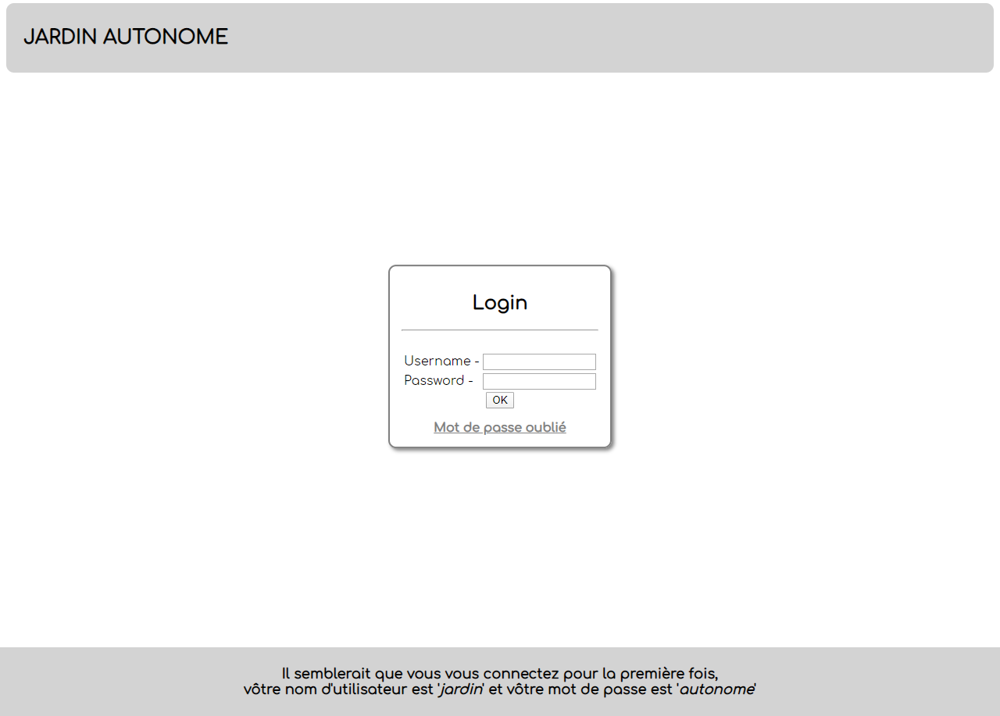
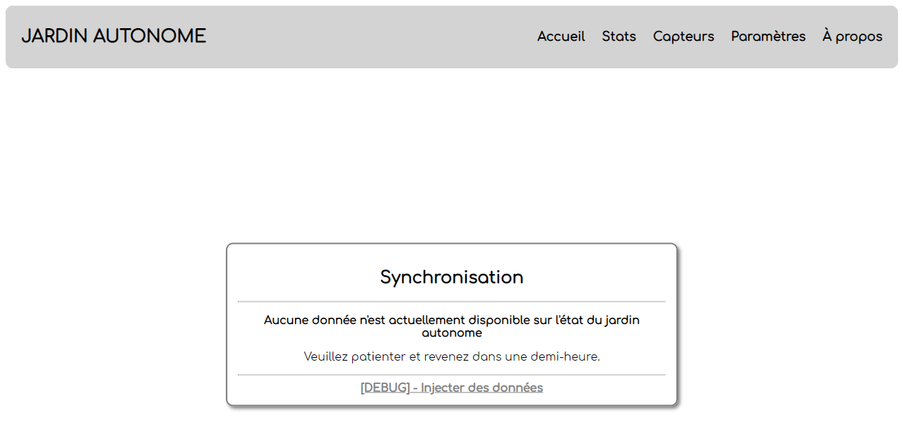
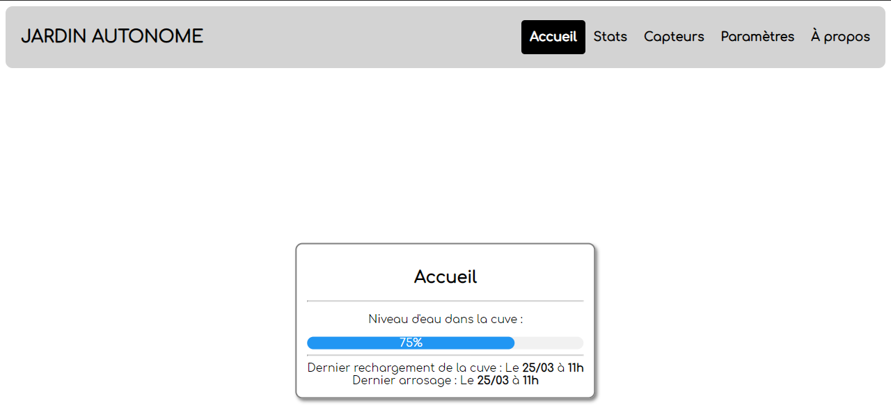
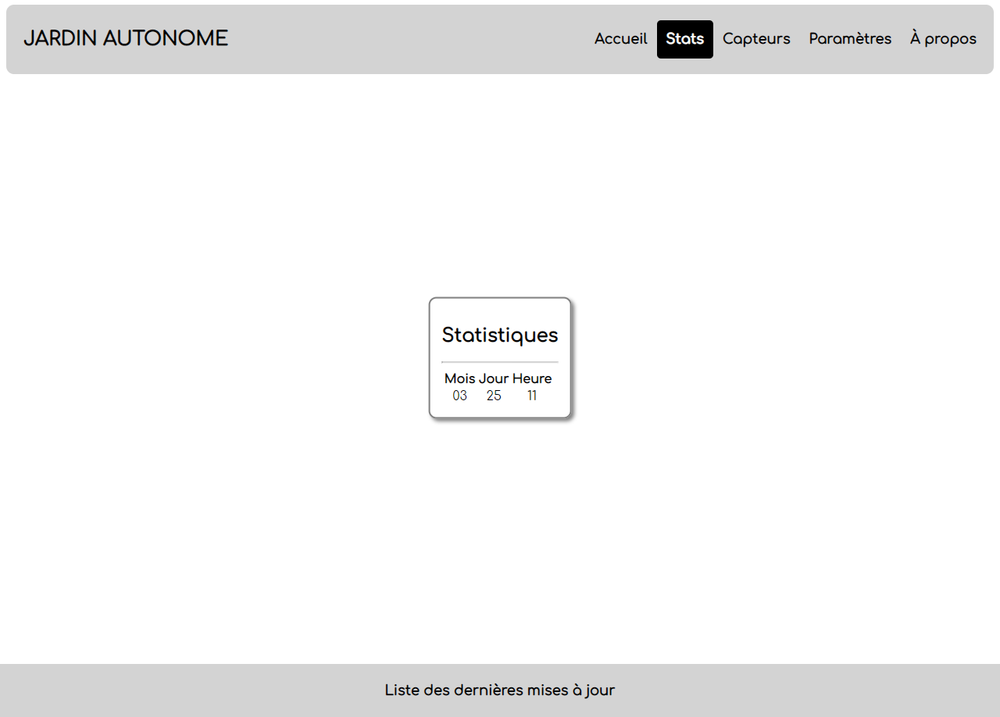
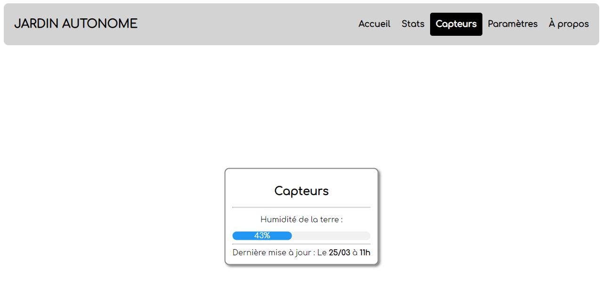
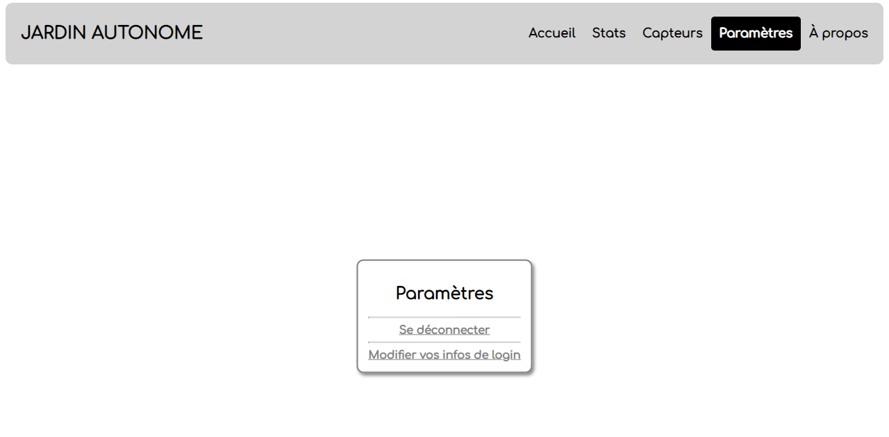
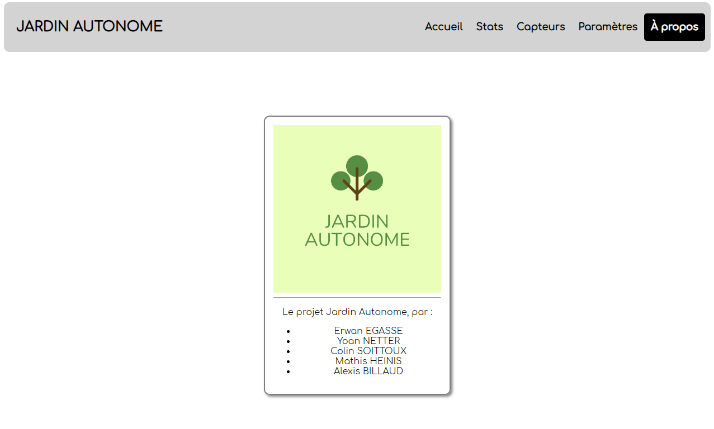

# Site Jardin Autonome

**/!\ J'ai pas utilisé de containers [Docker](https://www.docker.com/) ou [LXD](https://linuxcontainers.org/lxd/introduction/) pour ce projet, faites donc attention à la sécurité de votre serveur!** 

## Dépendances
Pour que le site fonctionne, il faut ces paquets installés sur le serveur de prod:
- MariaDB
- Apache2
- PHP (Minimum 7.0)

## Setup sur un serveur de prod (Debian 10)
- Installer Apache + PHP -> `sudo apt update && sudo apt install git php apache2 libapache2-mod-php`
- Installer et configurer MariaDB -> `sudo apt install mariadb && sudo secure-mysql-installation`
- Changer le plugin de login sur MariaDB, par défaut c'est `UNIX_SOCKET` mais pour pouvoir accéder à MariaDB depuis MySQLi dans PHP, il faut le remettre par défaut (voir les docs et StackOverflow)
- Modifier les permissions dans `/var/www/html/` avec `sudo chmod +rw -R /var/www/html/`
- Dump le repo dans `/var/www/html/` avec la commande `sudo rm -rf /var/www/html/* && git clone https://github.com/sandaidev/projet-site.git && sudo mv projet-site/* /var/www/html/`
- Modifier les infos de login dans les variables globales `$db_*` dans `./assets/lib/lib_jardin_autonome.php`
- Normalement le site devrait être OK, faites un bug report si c'est pas le cas.

## Screenshots

- Connexion :

- Synchronisation :

- Accueil :

- Statistiques :

- Capteurs : 

- Paramètres :

- À propos :

